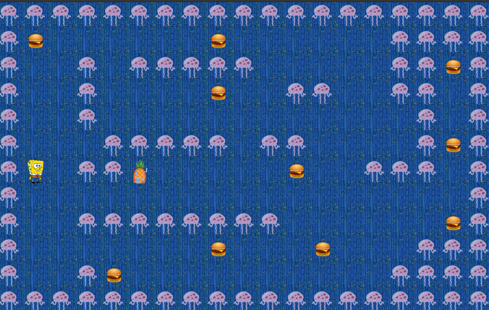

# so_long



## 🕹️ Project Overview

**so_long** is a simple 2D game developed using the MiniLibX graphics library, part of the 42 curriculum. The objective is for the player to collect all collectibles on the map and reach the exit while avoiding enemies (if present). The game features tile-based rendering, keyboard input handling, and error management.

## 🛠️ Features

- Real-time rendering using MiniLibX.
- Collectibles, player, walls, floor, and exit tiles.
- Custom map parsing with `.ber` file support.
- Input handling via keyboard (WASD or arrow keys).
- Memory management and error handling.
- Custom messages and polished output formatting.

## 🗺️ How to Play

1. **Controls:**
   - `W` / `↑` - Move Up
   - `S` / `↓` - Move Down
   - `A` / `←` - Move Left
   - `D` / `→` - Move Right
   - `ESC` - Exit game

2. **Objective:**
   - Collect all items.
   - Reach the exit (`E`) after collecting everything.

## 📦 Installation

```bash
make
```

To clean up object files:

```bash
make clean
```

To remove all binaries:

```bash
make fclean
```

To recompile everything:

```bash
make re
```

## 🧪 Running the Game

```bash
./so_long maps/level1.ber
```

Replace `maps/level1.ber` with the path to your desired map file.

## 📁 Map Rules

Your map must:
- Be rectangular.
- Be surrounded by walls (`1`).
- Contain:
  - One player (`P`)
  - At least one collectible (`C`)
  - One exit (`E`)

Example:
```
11111
1P0C1
10001
1C0E1
11111
```

## 🖼️ Assets

The game uses XPM images for tile graphics. All assets are placed in the `./textures` directory.

## ⚠️ Error Handling

The game provides helpful error messages if:
- The map is invalid or missing required elements.
- File extensions or arguments are incorrect.
- Memory allocation fails.

## 🙌 Credits

Developed by [Rami Al Fayad](https://github.com/Rami-Fayad) as part of the 42 School curriculum.  
Special thanks to MiniLibX for the simple graphics engine.
